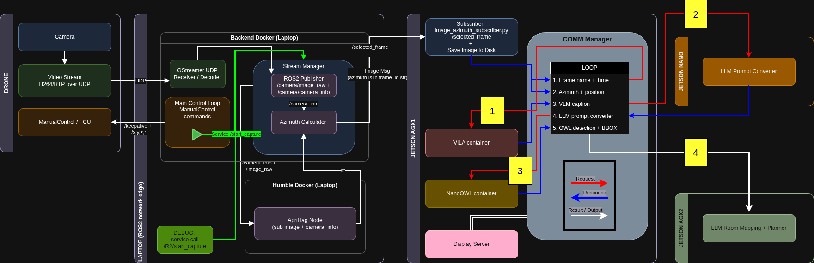

# Drone → ROS2 → VLM Pipeline: Integrated Guide

## 0. Pre-Flight Checklist
* **Hardware:** Drone (Preferably R1) powered ON.
* **Power:** Ensure drone battery is charged.
* **Connectivity:** COMM Unit ON and connected.
* **Environment:** Run `source ~/rqs_iai_ws/src/ros2_env.sh` on all machines/containers before starting.

## Architecture diagram


---

## A) Jetson AGX 1 (192.168.131.22)

### 1. VILA API Server
first- get in to the jetson:
```bash
ssh -X user@192.168.131.22
```
**Run inside the VILA container:**
```bash
jetson-containers run -it   --publish 8080:8080   \
--volume /home/user/jetson-containers/data:/home/user/jetson-containers/data  \
nano_llm_custom /bin/bash

```
Then start the API server:
```bash
python3 -m nano_llm.chat   --api=mlc \
   --model Efficient-Large-Model/VILA1.5-3b   \
   --max-context-len 256   --max-new-tokens 32   \
   --save-json-by-image   --server --port 8080 \
   --notify-url http://192.168.131.22:5050/from_vila
```
test:
```bash 
curl -s -X POST http://127.0.0.1:8080/describe   -H "Content-Type: application/json"   -d '{"image_path":"/mnt/VLM/jetson-data/PortraitA_01.jpg"}'
```

### 2. NanoOWL Object Detector
first- get in to the jetson:
```bash
ssh -X user@192.168.131.22
```

```bash
docker run -it --rm --name now_eng \
  --runtime nvidia \
  --network host --ipc=host \
  -e NVIDIA_VISIBLE_DEVICES=all \
  -e NVIDIA_DRIVER_CAPABILITIES=all \
  -e LD_LIBRARY_PATH=/usr/local/lib:/usr/lib/aarch64-linux-gnu:/usr/lib:/lib \
  nanoowl_new:v1.5 /bin/bash
```

 ```bash
cd examples/jetson_server/
python3 nanoowl_service.py \
  --engine /opt/nanoowl/data/owl_image_encoder_patch32.engine \
  --host 0.0.0.0 --port 5060 --min-score 0.2
```

test
```bash
curl -s -X POST http://172.16.17.12:5060/infer   
-F 'image=@/home/user/Pictures/PortraitA_01.jpg'   
-F 'prompts=["sky","a tree","a bulk"]'  
-F 'annotate=1' | python3 -c 'import sys,json; print(json.dumps(json.load(sys.stdin), indent=2))'


```

### 3. Communication Manager
first- get in to the jetson:

```bash
ssh -X user@192.168.131.22
```
**Run:**
```bash
cd ~/GIT/NanoLLM_VILA_and_OWL
python3 comm_manager_2.py   --host 0.0.0.0    --port 5050      --jetson2-endpoint http://192.168.131.21:5050/prompts    --captures-root /home/user/jetson-containers/data/R1/ --nanoowl-endpoint http://192.168.131.22:5060/infer   --forward-timeout 45   --forward-retries 3   --nanoowl-timeout 70   --nanoowl-annotate 0  --forward-json-url http://192.168.131.23:9090/ingest --endpoint http://192.168.131.22:8080/describe --force

         
 ```

### 4. Image & Azimuth Subscriber
```bash 
ssh user@192.168.131.22
```
```bash
source ~/rqs_iai_ws/src/ros2_env.sh
cd ~/rqs_iai_ws/src/examples/src
python3 image_azimuth_subscriber.py --out-dir /home/user/jetson-containers/data/R1
```

### 5. Display Server (Web GUI)
first- get in to the jetson:

```bash
ssh -X user@192.168.131.22
```
**Run:**
### make sure there is a folder (link to folder) called latest before first run

```bash 
ln -s "path/your/folder/" "latest" 
```

```bash
cd ~/GIT/NanoLLM_VILA_and_OWL
python3 display_server_2.py  \
 --root /home/user/jetson-containers/data/R1  \
  --host 0.0.0.0   --port 8090  \
   --latest-only

```

## B) Jetson Nano (192.168.131.21)
* LLM Object List Extractor, Prompt LLM Converter
Connect to Jetson #2:
```bash
ssh user@192.168.131.21
```
in terminal 2:
```bash
cd GIT/NanoLLM_VILA_and_OWL/LLM
gunicorn -w 1 -k gthread --threads 8 --timeout 120 -b 0.0.0.0:5050 prompt_converter_llm_v2:app
```
test 
```bash
curl -s http://192.168.131.21:5050/prompts \
  -H "Content-Type: application/json" \
  -d '{"caption":"two black suitcases with red and white labels on the ground"}'
  ```

## C) Jetson AGX 2 (192.168.131.23)
```bash
ssh nvidia@192.168.131.23
```
Terminal 1 – Start Ollama Server
```bash
ollama serve
```

Terminal 2 – Launch Room Mapping
```bash
ssh nvidia@192.168.131.23
```
```bash
cd ~/GIT/TheAgency/src/room_mapping
source .venv/bin/activate
```
```bash 
# Internet Connection needed for: 
# pip3 install requirements.txt
python3 run_llm_with_web.py
```


## D) Laptop / Backend
### 1. Docker Backend (Video Stream)
```bash
cd ~/rqs_iai_ws/src
docker compose up it 
```

In the backend container (it):
```bash 
docker exec -it it bash
source src/ros2_env.sh
cd src/examples/src
python3 video_stream.py
```

### 2. Docker April Tag
first- get in to the docker:
```bash

 docker run -it --rm     --net=host     --ipc=host     --env="DISPLAY"     --volume="/tmp/.X11-unix:/tmp/.X11-unix:rw"     --name ros2_apriltag     ros2-humble-apriltag
```
```bash

source src/./ros2_env.sh 
```

```bash
ros2 run apriltag_ros apriltag_node --ros-args \
  -r image_rect:=/R1/camera/image_raw \
  -r camera_info:=/R1/camera/camera_info \
  -p family:=36h11 \
  -p size:=2.00 \
  -p publish_tf:=true \
  -p qos_profile:=sensor_data \
  --log-level debug
```

## E) Execution & Demo Modes
### 1. Live Demo (With Drone Movement)
Use this to move the drone and capture live data.
1. Trigger Movement: On the Laptop Backend Docker:
Back on backend (same it container as step 1):
* flight-mode: 1 ROLL, 2 FLIGHT
```bash 
docker exec -it it bash

cd rqs_iai_ws
source ~/rqs_iai_ws/src/ros2_env.sh
cd src/examples/src/keyboard_control
python3 main_run_path_and_capture.py --path txt/roll_custom_path.txt
```

2. Run VLM Processing: Once movement finishes, run on AGX1:
```bash 
ssh -X user@192.168.131.22
source ~/rqs_iai_ws/src/ros2_env.sh
cd ~/rqs_iai_ws/src/examples/src
python3 vlm_backfill_latest.py   --base-dir /home/user/jetson-containers/data/R1   --endpoint http://192.168.131.22:8080/describe    --watch-interval 5.0 --sleep-between 20 --timeout 60

```

### 2. Direct Mode (Existing Directory)
Use this to process images already saved in the data folder. Video stream and path movement are not required.

Run on AGX1:
```bash 
ssh -X user@192.168.131.22
source ~/rqs_iai_ws/src/ros2_env.sh
cd ~/rqs_iai_ws/src/examples/src
python3 vlm_backfill_latest.py   --base-dir /home/user/jetson-containers/data/R1   --endpoint http://192.168.131.22:8080/describe    --watch-interval 5.0 --sleep-between 20 --timeout 60

```
## you can see the results here:

http://192.168.131.22:8090/

http://192.168.131.23:8080/


